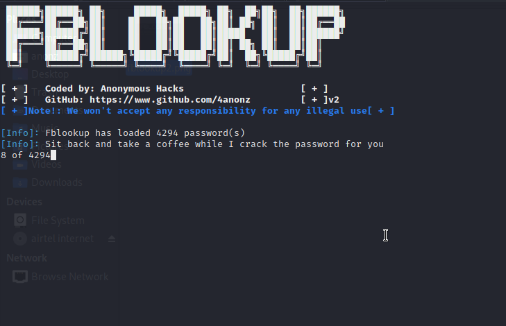

# fblookup
fblookup is a facebook password cracking tool written in C which allows you to hack every facebook account using a wordlist without any block from facebook firewall.
fblookup is a multi-platform tool, it can run on most of the unix-based OS like kali linux, macOS. it also works well windows OS and termux on android.
fblookup uses OpenSSL library to establish a SSL/TLS connection to facebook server
# Features
* Entirely written in C.
* It is fast which makes it different from most of the existed facebook burte force tools.
* Multi-platform, tasted on linux, macOS, windows and termux.
* It uses OpensSSL to establish a SSL/TLS connection to facebook server.
* No root is required.
# Screenshot

# Installation On Linux
First install OpenSSL
```
sudo apt-get install openssl libssl-dev
git clone https://github.com/4anonz/fblookup.git
cd fblookup
gcc main.c -o fblookup -lssl -lcrypto
./fblookup
```
# Installation On macOS
```
brew install openssl@1.1.1k
git clone https://github.com/4anonz/fblookup.git
cd fblookup
gcc fblookup.c -o fblookup -lssl -lcrypto
./fblookup
```
# Installation on Windows
Refer this link for installing OpenSSL on Windows
https://xolphin.com/support/OpneSSL/OpenSSL_-_Installation_under_Windows
Installing git on windows: https://phoenixnap.com/kb/how-to-install-git-windows
Compiling using MinGW
```
git clone https://github.com/4anonz/fblookup.git
cd fblookup
gcc fblookup.c -o fblookup -lws2_32 -lssl -lcrypto
./fblookup
```
# Installation on Termux
You need to install gcc(if not already) using: 
```
pkg install clang
```
Then openssl
```
pkg install openssl
pkg install openssl-tool
git clone https://github.com/4anonz/fblookup.git
cd fblookup
gcc fblookup.c -o fblookup -lws2_32 -lssl -lcrypto
./fblookup
```
# Author Contact
* [Contact](https://www.facebook.com/digitl.guru.1) - Anonymous Hacks
* feedback is always welcome.
Please leave me a star if you like this project :)
